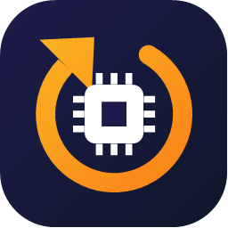
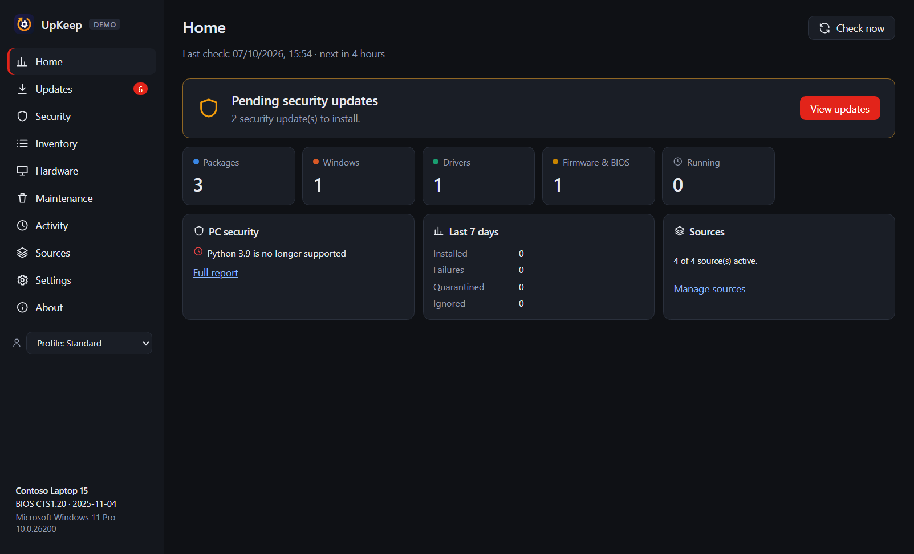

<div align="center">



# UpKeep

**Un seul endroit pour garder un PC Windows à jour — logiciels, Windows, pilotes, firmware et BIOS.**

[](https://github.com/HUG0Prat/upkeep/actions/workflows/ci.yml)
[](LICENSE)
[](LICENSE-COMMERCIAL.md)
[](#configuration-requise)
[](https://www.electronjs.org/)
[](#accessibilité-et-langues)

[Télécharger](https://github.com/HUG0Prat/upkeep/releases/latest) ·
[Premiers pas](#premiers-pas) ·
[Ligne de commande](#ligne-de-commande) ·
[Signaler un bug](https://github.com/HUG0Prat/upkeep/issues/new?template=bug_report.yml) ·
[Proposer une fonctionnalité](https://github.com/HUG0Prat/upkeep/issues/new?template=feature_request.yml) ·
[Licence commerciale](LICENSE-COMMERCIAL.md)

[English](README.md) · **Français**



</div>

---

UpKeep est une application Windows qui **vérifie régulièrement toutes les sources de mises à jour de votre PC** — gestionnaires de paquets, Microsoft Store, Windows Update, pilotes graphiques, outils du constructeur et écosystèmes de développement — et les présente dans une seule liste. Vous décidez de ce qui s'installe, ou vous laissez UpKeep le faire automatiquement selon vos règles. Il prend les précautions qu'exigent le firmware et le BIOS, regroupe les installations administrateur derrière une seule fenêtre UAC et signale les mises à jour qui corrigent des failles activement exploitées.

Tout fonctionne en local : **ni compte, ni télémétrie, ni serveur UpKeep.**

> La documentation de référence (contribution, sécurité, support, confidentialité) est en anglais. Ce fichier en reprend l'essentiel en français.

## Sommaire

- [Pourquoi UpKeep](#pourquoi-upkeep)
- [Fonctionnalités](#fonctionnalités)
- [Sources prises en charge](#sources-prises-en-charge)
- [Configuration requise](#configuration-requise)
- [Installation](#installation)
- [Premiers pas](#premiers-pas)
- [Utilisation](#utilisation)
- [Ligne de commande](#ligne-de-commande)
- [Configuration et données](#configuration-et-données)
- [Sécurité](#sécurité)
- [Confidentialité](#confidentialité)
- [Accessibilité et langues](#accessibilité-et-langues)
- [Dépannage](#dépannage)
- [Compiler depuis les sources](#compiler-depuis-les-sources)
- [État du projet](#état-du-projet)
- [Contribuer](#contribuer)
- [Licence](#licence)
- [Marques](#marques)

## Pourquoi UpKeep

Tenir un PC Windows à jour, c'est jongler entre winget, le Microsoft Store, Windows Update, l'application du fabricant de la carte graphique, l'utilitaire du constructeur du PC et une demi-douzaine de gestionnaires de paquets de développement — chacun avec son rythme, ses fenêtres et ses erreurs. Les pilotes et le BIOS sont les plus importants pour la stabilité et la sécurité, et les plus faciles à oublier.

UpKeep les réunit :

- **Une seule liste, sans doublons.** Un logiciel vu par plusieurs sources (winget et Microsoft Store, par exemple) n'apparaît qu'une fois.
- **Prudent par défaut.** Point de restauration avant les pilotes et Windows ; contrôle de la batterie, du chargeur, de Secure Boot, du TPM et de BitLocker avant un firmware ; BitLocker suspendu pour un redémarrage afin d'éviter la clé de récupération.
- **La sécurité d'abord.** Les mises à jour qui corrigent une faille du catalogue CISA *Known Exploited Vulnerabilities* sont marquées **exploitée** et mises en avant ; les logiciels en fin de support sont signalés.
- **Vos règles.** Quarantaine des nouvelles versions, versions majeures épinglées, éléments ignorés, automatisation dans une plage horaire — jamais sur batterie, sur connexion limitée ni en jeu.

## Fonctionnalités

**Détection** — 28 sources vérifiées selon un planning, au démarrage, au réveil et au retour du réseau ; comparaison de versions fiable ; préversions masquées ; pilotes de périphériques absents détectés ; pilotes facultatifs distingués ; mises à jour de fonctionnalités Windows ; stratégies de l'organisation (WSUS, exclusion des pilotes, Intune) respectées.

**Installation** — une fenêtre UAC par lot ; assistant administrateur facultatif sans UAC ; mode simulation ; version précise, retour arrière, restauration de pilote, téléchargement seul ; fermeture et relance des applications ; contrôle de l'espace disque ; nouvelle tentative réseau ; redémarrage maintenant, à une heure précise, dans *n* minutes ou pas du tout.

**Sécurité** — failles activement exploitées (CISA KEV) ; vulnérabilités des paquets de développement (OSV) et des logiciels de bureau courants (NVD) ; fins de support (endoflife.date) ; état du poste (Defender, pare-feu, BitLocker, Secure Boot, TPM, UAC, SmartScreen) ; installeurs vérifiés (SHA-256, signature Authenticode, éditeur attendu).

**Au quotidien** — tableau de bord, recherche globale (<kbd>Ctrl</kbd>+<kbd>K</kbd>), raccourcis clavier ; notifications Windows actionnables et résumé hebdomadaire ; profils, règles à jokers, quarantaine, options par paquet ; inventaire, fiche matériel, historique exportable en CSV ; nettoyage des anciens pilotes et des caches ; export et réimport de la liste des paquets.

## Sources prises en charge

| Groupe | Sources |
|---|---|
| **Paquets** | WinGet (module Microsoft.WinGet.Client si présent), Scoop, Chocolatey |
| **Applications** | Microsoft Store, Chrome, Edge, Firefox, extensions Visual Studio Code, images Docker |
| **Windows** | Windows Update (cumulatives, Defender, .NET, Office…), mises à jour de fonctionnalités, WSL |
| **Pilotes et firmware** | pilotes et firmware Windows Update (UEFI/BIOS), NVIDIA (Game Ready / Studio), Intel (graphique et DSA), AMD (information), Lenovo (LSUClient), Dell (Dell Command \| Update), HP (HP Image Assistant), ASUS (BIOS) |
| **Développement** | npm, pnpm, Yarn, Bun, pip, pipx, cargo, outils .NET, PowerShell Gallery, paquets des distributions WSL (apt, dnf, pacman, zypper) |

## Configuration requise

Windows 10 22H2 ou Windows 11 (x64), Windows PowerShell 5.1 (intégré). winget et les outils des sources souhaitées sont facultatifs. Les droits administrateur ne sont demandés que lorsqu'une mise à jour en a besoin.

## Installation

Chaque version est fournie pour **x64** et **ARM64** : installeur (`-setup.exe`), portable (`-portable.exe`), MSI (déploiement Intune, stratégies de groupe, Configuration Manager), MSIX/AppX, ZIP et 7z, avec `SHA256SUMS.txt` pour vérifier les téléchargements.

- **Installeur** : `UpKeep-<version>-<arch>-setup.exe` depuis la [dernière version](https://github.com/HUG0Prat/upkeep/releases/latest). Installeur guidé : langue, installation pour vous seul ou pour tous les utilisateurs, dossier, raccourci sur le Bureau, lancement à la fin. Installation silencieuse : `/S` (+ `/allusers`, `/D=dossier`).
- **Portable** : `UpKeep-<version>-<arch>-portable.exe` ; les données sont dans `UpKeep-data` à côté de l'exécutable.
- **MSI** : `msiexec /i UpKeep-<version>-x64.msi /qn`.
- **MSIX/AppX** : pas encore signé par un éditeur de confiance ; en mode développeur, `Add-AppxPackage .\UpKeep-<version>-x64.appx -AllowUnsigned`.
- **winget** : manifeste prêt, soumis dès que les versions seront signées (`winget install HUG0Prat.UpKeep`).

> [!NOTE]
> Les exécutables ne sont pas encore signés : SmartScreen peut afficher un avertissement au premier lancement.

## Premiers pas

1. **Lancez UpKeep.** L'accueil demande la langue, les sources à surveiller (celles détectées sont cochées) et la fréquence.
2. **Attendez la première vérification** (environ une minute, surtout pour Windows Update). Les résultats s'affichent au fil de l'eau.
3. **Parcourez la liste.** Un clic sur un nom ouvre le panneau de détail (notes de version depuis votre version, options, mode automatique). Clic droit pour plus d'actions.
4. **Installez.** Sélectionnez puis *Mettre à jour la sélection*, ou utilisez le bouton de la ligne. Suivez l'installation dans *Activité*.

Pour essayer sans risque : **Paramètres › Installation › Mode simulation** — tout s'exécute, rien ne s'installe.

## Utilisation

**Étiquettes** : `sécurité` (mise à jour de sécurité), `exploitée` (faille activement exploitée, à installer en priorité), `facultatif` (pilote facultatif), `manuelle` (UpKeep ouvre la page ou l'outil de l'éditeur), `préversion`, `quarantaine` (version trop récente, retenue).

**Firmware et BIOS** : état de Secure Boot, du TPM et de BitLocker affiché ; batterie et chargeur contrôlés ; point de restauration ; suspension de BitLocker pour un redémarrage. Jamais installés automatiquement ni par `--install-all`.

> [!WARNING]
> Ne coupez pas l'alimentation pendant l'application d'un firmware ou d'un BIOS.

**Automatisation** (*Paramètres › Automatisation*) : par source ou par paquet, dans une plage horaire, jamais en connexion limitée, batterie faible, plein écran, jeu ou mode Focus ; quarantaine de *n* jours (sauf sécurité). *Vérifier même quand UpKeep est fermé* crée une tâche planifiée sans droits administrateur.

**Règles et profils** : motifs à jokers (`*.Preview`, `Microsoft.*`, `*chrome*`) pour ignorer, automatiser, ne jamais automatiser ou ne pas notifier ; profils de réglages choisis au démarrage, dans la barre latérale ou avec `--profile=<id>`.

**Périphériques absents** : Windows se souvient de tout périphérique déjà branché et continue de proposer ses pilotes (d'où un pilote Razer sans souris Razer). UpKeep les masque ; **Oublier** retire le périphérique de la mémoire de Windows.

**Sauvegarde** (*Paramètres › Sauvegarde*) : export et réimport de la liste des paquets (winget, Scoop, npm, pip, pipx, cargo, outils .NET, extensions VS Code) et des paramètres.

## Ligne de commande

| Option | Effet |
|---|---|
| `--check` | interroge toutes les sources activées puis affiche les mises à jour |
| `--list` | affiche le dernier résultat connu sans interroger les sources |
| `--json` | sortie JSON |
| `--install <source:id>…` | installe des mises à jour précises |
| `--install-all` | installe tout **sauf firmware/BIOS** |
| `--yes` | sans confirmation |
| `--profile=<id>` | applique un profil pour cette exécution |

Codes de sortie : `0` rien à faire ou succès, `10` mises à jour disponibles, `1` erreur ou échec d'installation.

```powershell
upkeep-cli --check --json | Out-File maj.json
if ($LASTEXITCODE -eq 10) { upkeep-cli --install-all --yes }
```

## Configuration et données

Données dans `%APPDATA%\UpKeep\` (version portable : `UpKeep-data\`), journaux dans `logs\` (1 Mo, 3 fichiers, nom d'utilisateur masqué), assistant administrateur facultatif dans `C:\ProgramData\UpKeep\`. Variables : `UPKEEP_DATA`, `UPKEEP_FAKE=1` (démo), `UPKEEP_PS_HOSTS`, `UPKEEP_NO_PS_POOL=1`, `UPKEEP_GPU=1`.

## Sécurité

Rien de ce qui vient d'Internet n'est considéré comme fiable : aucune commande administrateur libre (liste fermée d'opérations typées, paramètres validés) ; script élevé vérifié en mémoire au moment de l'exécution ; installeurs vérifiés (HTTPS, SHA-256, signature, éditeur) ; interface isolée (sandbox, CSP, aucune navigation, IPC vérifiés) ; fusibles Electron durcis. Signalez une vulnérabilité en privé : voir [SECURITY.md](SECURITY.md).

## Confidentialité

UpKeep ne contacte que des services publics, sans identifiant, pour connaître les dernières versions. Rapports de plantage et de diagnostic restent sur votre PC. Détail de chaque service dans [PRIVACY.md](PRIVACY.md).

## Accessibilité et langues

Interface en **français, anglais, allemand et espagnol** (ou langue de Windows) ; entièrement utilisable au clavier ; vérifiée automatiquement selon **WCAG 2.1 AA** (axe-core) sur toutes les pages, dans les deux thèmes ; contraste élevé et réduction des animations pris en charge.

## Dépannage

Voir [SUPPORT.md](SUPPORT.md) (en anglais). Pour signaler un problème, joignez le rapport créé dans *Paramètres › Sauvegarde › Rapport de diagnostic* (local, données personnelles masquées).

## Compiler depuis les sources

Windows 10/11, [Node.js](https://nodejs.org/) 24 et npm :

```bash
git clone https://github.com/HUG0Prat/upkeep.git
cd REPO
npm ci
npm run start:demo
```

`npm run dev` (développement), `npm test` (tests unitaires), `npm run test:e2e` (interface et accessibilité), `npm run package` (installeur et portable x64), `npm run dist` (tous les formats, x64 et ARM64, dans `dist/`).

## État du projet

Version 1.x, en développement actif. Limites connues : pilotes AMD signalés sans comparaison de version (AMD bloque les accès automatisés) ; firmware des SSD renvoyé vers l'outil du fabricant ; mises à jour de fonctionnalités confiées à Windows Update ; Dell, HP, ASUS et l'assistant administrateur à tester plus largement ; exécutables pas encore signés.

## Contribuer

Les contributions sont les bienvenues : voir [CONTRIBUTING.md](CONTRIBUTING.md) et le [code de conduite](CODE_OF_CONDUCT.md). Questions : [GitHub Discussions](https://github.com/HUG0Prat/upkeep/discussions).

## Licence

UpKeep est proposé sous **double licence** :

- **[PolyForm Noncommercial 1.0.0](LICENSE)** — gratuit pour un usage personnel, l'étude, la recherche, les associations, l'enseignement et les organismes publics ; modification et partage autorisés à des fins non commerciales.
- **[Licence commerciale](LICENSE-COMMERCIAL.md)** — obligatoire pour toute utilisation ou modification à des fins commerciales (entreprises, indépendants, services informatiques, infogérance, redistribution dans un produit commercial).

Composants tiers : [THIRD_PARTY_NOTICES.md](THIRD_PARTY_NOTICES.md).

## Marques

Microsoft, Windows, NVIDIA, Intel, AMD, Lenovo, Dell, HP, ASUS et les autres noms cités sont des marques de leurs propriétaires respectifs. UpKeep est un projet indépendant, sans affiliation avec eux. This product uses the NVD API but is not endorsed or certified by the NVD.
