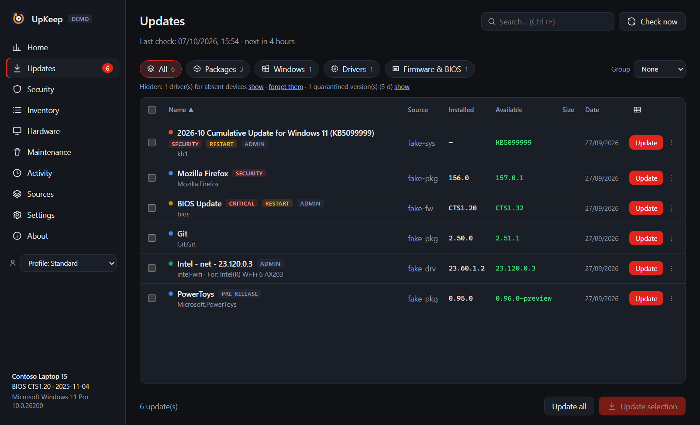
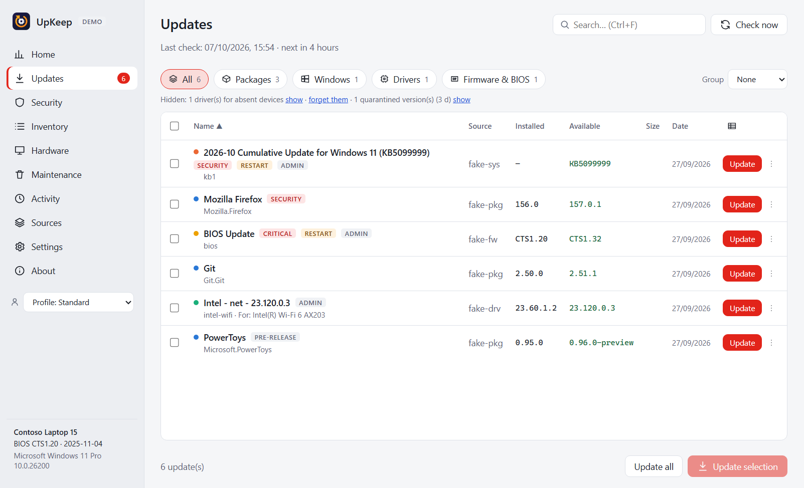
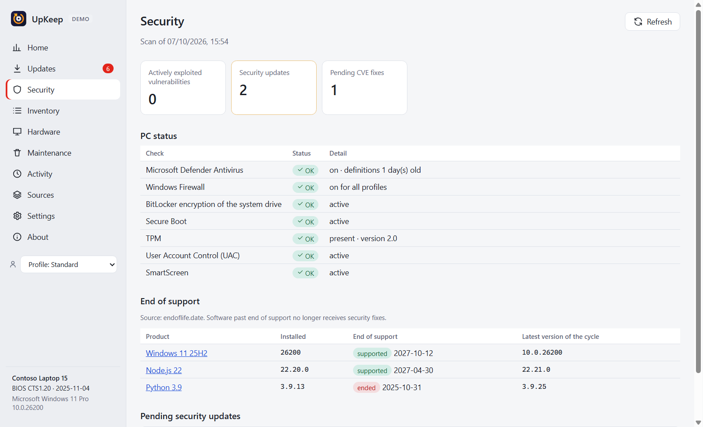

<div align="center">


# UpKeep

**One place to keep a Windows PC up to date — apps, Windows, drivers, firmware and BIOS.**

[](https://github.com/HUG0Prat/upkeep/actions/workflows/ci.yml)
[](LICENSE)
[](LICENSE-COMMERCIAL.md)
[](#requirements)
[](https://www.electronjs.org/)
[](https://www.typescriptlang.org/)
[](#accessibility-and-languages)

[Download](https://github.com/HUG0Prat/upkeep/releases/latest) ·
[Getting started](#getting-started) ·
[CLI](#command-line-interface) ·
[Report a bug](https://github.com/HUG0Prat/upkeep/issues/new?template=bug_report.yml) ·
[Request a feature](https://github.com/HUG0Prat/upkeep/issues/new?template=feature_request.yml) ·
[Commercial licensing](LICENSE-COMMERCIAL.md)

**English** · [Français](README.fr.md)


</div>

---

UpKeep is a desktop application for Windows that **periodically checks every source of updates on your PC** — package managers, Microsoft Store, Windows Update, graphics drivers, PC-manufacturer tools and developer ecosystems — and shows them in a single list. You decide what to install, or let UpKeep do it automatically within rules you define. It takes the precautions that firmware and BIOS updates require, groups administrator installs behind a single UAC prompt, and flags updates that fix actively exploited vulnerabilities.

Everything runs locally: **no account, no telemetry, no UpKeep server.**

## Table of contents

- [Why UpKeep](#why-upkeep)
- [Features](#features)
- [Supported sources](#supported-sources)
- [Screenshots](#screenshots)
- [Requirements](#requirements)
- [Installation](#installation)
- [Getting started](#getting-started)
- [Using UpKeep](#using-upkeep)
- [Command-line interface](#command-line-interface)
- [Configuration and data](#configuration-and-data)
- [Security](#security)
- [Privacy](#privacy)
- [Accessibility and languages](#accessibility-and-languages)
- [Troubleshooting](#troubleshooting)
- [Architecture](#architecture)
- [Building from source](#building-from-source)
- [Project status](#project-status)
- [Contributing](#contributing)
- [License](#license)
- [Trademarks](#trademarks)

## Why UpKeep

Keeping a Windows PC current means juggling winget, the Microsoft Store, Windows Update, the GPU vendor's app, the PC manufacturer's utility, and half a dozen developer package managers — each with its own schedule, prompts and failure modes. Driver and BIOS updates are the most important for stability and security, and the easiest to forget.

UpKeep brings them together:

- **One list, no duplicates.** The same software seen by several sources (for example winget and the Microsoft Store) is merged.
- **Safe by default.** Restore point before drivers and Windows updates; battery, AC power, Secure Boot, TPM and BitLocker checks before firmware; BitLocker suspended for one restart so you are not asked for the recovery key.
- **Security first.** Updates that fix a vulnerability listed in the CISA *Known Exploited Vulnerabilities* catalog are marked **exploited** and surfaced first; end-of-support software is reported.
- **Your rules.** Quarantine new releases for a few days, pin major versions, ignore what you never want, automate the rest within a time window — and never on battery, on a metered connection or while you are gaming.

## Features

<table>
<tr><td width="50%" valign="top">

**Detection**
- 28 sources, checked on a schedule, on startup, on wake and when the network returns
- Reliable version comparison, pre-releases hidden by default
- Drivers for devices that are no longer connected detected and hidden
- Optional Windows Update drivers distinguished from recommended ones
- Windows feature updates (e.g. 24H2 → 25H2) detected
- Organization policies (WSUS, driver exclusion, Intune) respected

</td><td width="50%" valign="top">

**Installation**
- One UAC prompt per batch, across sources
- Optional administrator helper for prompt-free automatic installs
- Simulation mode: run the whole pipeline without installing anything
- Specific version, rollback, driver rollback, download only
- Close and relaunch running apps, disk space check, network retry
- Flexible restart: now, at a given time, in *n* minutes, or not at all

</td></tr>
<tr><td valign="top">

**Security**
- Actively exploited vulnerabilities (CISA KEV)
- Known vulnerabilities of developer packages (OSV) and common desktop apps (NVD)
- End of support for Windows, Python, Node.js, .NET, Java… (endoflife.date)
- PC status: Defender, firewall, BitLocker, Secure Boot, TPM, UAC, SmartScreen
- Downloaded installers verified (SHA-256, Authenticode signature, expected publisher)

</td><td valign="top">

**Everyday use**
- Dashboard, global search (<kbd>Ctrl</kbd>+<kbd>K</kbd>), keyboard shortcuts
- Actionable Windows notifications (*Update*, *Later*, *Ignore*) and a weekly summary
- Profiles, wildcard rules, quarantine, per-package options
- Find and install software from WinGet, Microsoft Store, Scoop and Chocolatey
- Inventory of installed software, hardware sheet, history with CSV export
- Cleanup of superseded drivers and caches; forget absent devices
- Export and re-import your package list on another PC
- Updates itself from GitHub releases (installed version; other formats are notified)

</td></tr>
</table>

## Supported sources

| Group | Sources |
|---|---|
| **Packages** | WinGet (via the Microsoft.WinGet.Client module when available), Scoop, Chocolatey |
| **Applications** | Microsoft Store, Chrome, Edge, Firefox, Visual Studio Code extensions, Docker images |
| **Windows** | Windows Update (cumulative, Defender, .NET, Office…), Windows feature updates, WSL |
| **Drivers & firmware** | Windows Update drivers and firmware (UEFI/BIOS), NVIDIA (Game Ready / Studio), Intel graphics and Intel DSA, AMD (information only), Lenovo (LSUClient), Dell (Dell Command \| Update), HP (HP Image Assistant), ASUS (BIOS) |
| **Development** | npm, pnpm, Yarn, Bun, pip, pipx, cargo, .NET tools, PowerShell Gallery, packages inside WSL distributions (apt, dnf, pacman, zypper) |

Only sources detected on your PC are enabled on first run. Each source can be enabled, disabled, scheduled and diagnosed individually.

## Screenshots

| Updates (dark) | Updates (light) |
|---|---|
|  |  |
| **Security report** | **Dashboard** |
|  |  |

<sub>Screenshots are taken in demo mode with fictional data (`npm run start:demo`).</sub>

## Requirements

| | Minimum |
|---|---|
| Operating system | Windows 10 22H2 or Windows 11, x64 |
| PowerShell | Windows PowerShell 5.1 (built in) |
| Optional | winget (App Installer), plus the tools of the sources you want to use |

Administrator rights are only requested when an update needs them.

## Installation

Every release provides the following packages for **x64** and **ARM64** (replace `<arch>` with `x64` or `arm64`):

| Package | File | Best for |
|---|---|---|
| **Installer** | `UpKeep-<version>-<arch>-setup.exe` | most users |
| **Portable** | `UpKeep-<version>-<arch>-portable.exe` | USB drives, no installation |
| **MSI** | `UpKeep-<version>-<arch>.msi` | deployment with Intune, Group Policy or Configuration Manager |
| **MSIX / AppX** | `UpKeep-<version>-<arch>.appx` | sideloading |
| **ZIP / 7z** | `UpKeep-<version>-<arch>.zip`, `.7z` | manual extraction, scripted setups |

Check downloads against `SHA256SUMS.txt`:

```powershell
Get-FileHash .\UpKeep-1.1.0-x64-setup.exe -Algorithm SHA256
```

### Installer

Run `UpKeep-<version>-<arch>-setup.exe`. The guided installer lets you choose:

- the language (English, French, German, Spanish);
- **only for me** (no administrator rights) or **for all users**;
- the installation folder;
- whether to create a desktop shortcut;
- whether to start UpKeep when setup finishes.

It also adds `upkeep-cli.cmd` next to the executable. Silent installation: `/S`, plus `/allusers` for a per-machine install and `/D=C:\Path` (last argument) to choose the folder.

### Portable

Run `UpKeep-<version>-<arch>-portable.exe` from anywhere. Settings and history are stored in an `UpKeep-data` folder next to the executable.

### MSI

```powershell
msiexec /i UpKeep-1.1.0-x64.msi /qn
```

### MSIX / AppX

The package is not signed by a trusted publisher yet. On Windows 11, turn on *Developer Mode*, then:

```powershell
Add-AppxPackage .\UpKeep-1.1.0-x64.appx -AllowUnsigned
```

### winget

A winget manifest is prepared and will be submitted once releases are signed:

```bash
winget install HUG0Prat.UpKeep
```

### From source

See [Building from source](#building-from-source).

> [!NOTE]
> Release binaries are not code-signed yet, so Windows SmartScreen may warn on first launch.

## Getting started

1. **Launch UpKeep.** The welcome screen asks for your language, the sources to watch (detected ones are pre-selected) and how often to check.
2. **Wait for the first check.** It takes about a minute; most of that time is Windows Update itself. Results appear as each source finishes.
3. **Review the list.** Click a name to open the detail panel (release notes since your version, options, automatic mode). Right-click for more actions.
4. **Install.** Select updates and choose *Update selection*, or use the button on a row. Installs run in the background; follow them in *Activity*.

Want to look around first? Turn on **Settings › Installation › Simulation mode**: everything runs, nothing is installed.

## Using UpKeep

### Tags

| Tag | Meaning |
|---|---|
| `security` | security update |
| `exploited` | fixes a vulnerability that is being actively exploited — install first |
| `optional` | optional driver offered by Windows Update |
| `manual` | UpKeep opens the vendor's page or tool instead of installing |
| `pre-release` | beta, RC… (hidden by default) |
| `quarantine` | release too recent, held back for the configured number of days |

### Firmware and BIOS

Before a firmware update, UpKeep shows the Secure Boot, TPM and BitLocker state, checks the battery level and the charger, creates a restore point and can suspend BitLocker for one restart. Firmware is never installed automatically, and never by `--install-all`.

> [!WARNING]
> Do not power off the PC while a firmware or BIOS update is being applied.

### Automation

*Settings › Automation* lets you enable automatic updates per source or per package, restricted to a time window and blocked on metered connections, on low battery, in full screen, in games or in Focus mode. New releases can be quarantined for *n* days (security updates are never held back). *Check even when UpKeep is closed* creates a Windows scheduled task that needs no administrator rights.

### Rules and profiles

- **Rules** use wildcards (`*`, `?`) to ignore packages, make them automatic, never install them automatically, or silence their notifications — for example `*.Preview`, `Microsoft.*`, `*chrome*`.
- **Profiles** are sets of overrides (enabled sources, automation, quarantine…) applied on top of your settings. Pick one at startup, from the sidebar, or with `--profile=<id>`.

### Absent devices

Windows remembers every device that was ever connected and keeps offering its drivers — which is why a Razer driver can show up on a PC that never had a Razer mouse. UpKeep hides those drivers by default; **Forget** removes the device from Windows' memory. If it is plugged in again, it is simply detected again.

### Backup

*Settings › Backup* exports the list of your packages (winget, Scoop, npm, pip, pipx, cargo, .NET tools, VS Code extensions) and re-imports it on another PC, installing only what is missing. Settings, profiles and rules can be exported too.

## Command-line interface

The installer ships `upkeep-cli.cmd`. It shares settings, cache and history with the application.

| Option | Effect |
|---|---|
| `--check` | query every enabled source, then list available updates |
| `--list` | list the last known result without querying sources |
| `--json` | JSON output (with `--check` or `--list`) |
| `--install <source:id>…` | install specific updates (keys are shown in the JSON output) |
| `--install-all` | install every visible update **except firmware/BIOS** |
| `--yes` | do not ask for confirmation |
| `--profile=<id>` | apply a profile for this run |

| Exit code | Meaning |
|---|---|
| `0` | nothing to do, or installation succeeded |
| `10` | updates are available (`--check`, `--list`) |
| `1` | error, or at least one installation failed |

```powershell
upkeep-cli --check --json | Out-File updates.json
if ($LASTEXITCODE -eq 10) { upkeep-cli --install-all --yes }
```

## Configuration and data

| Location | Content |
|---|---|
| `%APPDATA%\UpKeep\` | settings, history, cache, logs, downloads (portable: `UpKeep-data\` next to the executable) |
| `%APPDATA%\UpKeep\logs\` | rotating log files (1 MB, 3 files), user name redacted |
| `C:\ProgramData\UpKeep\` | optional administrator helper and its queue |

| Environment variable | Effect |
|---|---|
| `UPKEEP_DATA` | use another data folder |
| `UPKEEP_FAKE=1` | demo mode with fictional sources (nothing touches the system) |
| `UPKEEP_PS_HOSTS` | number of persistent PowerShell hosts (default 3) |
| `UPKEEP_NO_PS_POOL=1` | one PowerShell process per command |
| `UPKEEP_GPU=1` | re-enable GPU acceleration of the interface |

## Security

UpKeep installs software with administrator rights, so its design assumes that **nothing that comes from the Internet is trusted**:

- **No free-form elevated scripts.** Sources produce typed operations from a closed list (install this Windows Update by GUID, this winget package, this verified installer with fixed arguments). Every parameter is validated before use.
- **Verified at execution time.** The elevated script is read into memory and its SHA-256 checked before it runs; the optional administrator helper's hash is checked before every use.
- **Verified installers.** HTTPS, published SHA-256 when available, valid Authenticode signature and expected publisher.
- **Locked-down interface.** Context isolation, sandbox, CSP, no navigation, no new windows, no permissions; every IPC call checks its sender.
- **Hardened binary.** Electron fuses: no `NODE_OPTIONS`, no inspector, ASAR integrity, app loaded only from the ASAR archive.

Please report vulnerabilities privately — see [SECURITY.md](SECURITY.md).

## Privacy

UpKeep only contacts public services, without any identifier, to learn the latest versions (package registries, Microsoft, vendor sites, OSV, NVD, CISA, endoflife.date). Crash reports and diagnostic bundles stay on your PC unless you choose to share them. Every service contacted and what is sent is listed in [PRIVACY.md](PRIVACY.md).

## Accessibility and languages

- Interface available in **English, French, German and Spanish** (or follows the Windows language).
- Fully usable with the keyboard; focus is trapped in dialogs and restored on close.
- Checked automatically against **WCAG 2.1 AA** with axe-core on every page in both themes, plus keyboard and 200 % zoom tests.
- Light and dark themes, Windows accent color, high-contrast mode and reduced motion supported.

## Troubleshooting

The most common questions — drivers for devices you never had, missing Windows Update drivers, slow checks, failed installs, UAC, BitLocker — are answered in [SUPPORT.md](SUPPORT.md). When reporting a problem, attach the diagnostic bundle from *Settings › Backup › Diagnostic report* (created locally, user data redacted).

## Architecture

```
electron/
  main.ts          windows, tray, notifications, upkeep:// protocol, IPC, hardening
  engine/          scheduling, cache, filters (index.ts) · install queue (queue.ts) · restarts (reboot.ts)
  providers/       one file per source: detect() · check() · install() / elevatedOps()
  lib/             PowerShell host pool, HTTP, elevated operations, helper, security feeds, maintenance, logging
  cli.ts           command-line interface
shared/            types, pure logic (versions, rules, filters, profiles), translations
src/               React interface
tests/             unit (Vitest), real-world fixtures, end-to-end and accessibility (Playwright)
scripts/           fixture capture, release, third-party notices, packaged-app smoke test
```

The interface never talks to the system directly: it asks the main process through a small, typed preload API. Checks run through a pool of persistent PowerShell hosts; administrator work is batched into one elevation. See [CONTRIBUTING.md](CONTRIBUTING.md#architecture) for details.

## Building from source

Prerequisites: Windows 10/11, [Node.js](https://nodejs.org/) 24 and npm.

```bash
git clone https://github.com/HUG0Prat/upkeep.git
cd REPO
npm ci
```

| Command | Purpose |
|---|---|
| `npm run dev` | development with hot reload |
| `npm run start:demo` | demo mode with fictional sources |
| `npm test` | unit tests |
| `npm run test:e2e` | build, then end-to-end and accessibility tests |
| `npm run package` | x64 installer and portable executable in `dist/` |
| `npm run dist` | **every** package (installer, portable, MSI, MSIX, ZIP, 7z) for x64 and ARM64 in `dist/`, with `SHA256SUMS.txt` |

Continuous integration runs type checking, unit tests, the build, Playwright tests, packaging and a smoke test of the packaged app on Windows for every push and pull request.

## Project status

UpKeep is in active development (version 1.x). Known limitations:

- **AMD graphics drivers** are reported but not version-checked: AMD publishes no version API and blocks automated access.
- **SSD firmware** links to the manufacturer's tool; versions are not compared.
- **Windows feature updates** are detected; installation is handed over to Windows Update.
- Dell, HP and ASUS sources and the administrator helper still need wider testing on real hardware — [fixtures from your PC](CONTRIBUTING.md#testing-on-real-hardware) are very welcome.
- Release binaries are not yet code-signed. Self-update checks each installer against the SHA-512 published in the release's `latest.yml`, but not against an Authenticode signature.

## Contributing

Contributions are welcome — bug reports, translations, fixtures from hardware we have not tested, and code. Please read [CONTRIBUTING.md](CONTRIBUTING.md) and our [Code of Conduct](CODE_OF_CONDUCT.md) first. For questions, use [GitHub Discussions](https://github.com/HUG0Prat/upkeep/discussions).

## License

UpKeep is **dual-licensed**:

- **[PolyForm Noncommercial 1.0.0](LICENSE)** — free for personal use, study, research, and for charities, educational and public institutions. You may modify and share it for noncommercial purposes.
- **[Commercial license](LICENSE-COMMERCIAL.md)** — required for any commercial use or modification (businesses, freelancers, IT departments, managed service providers, redistribution in a commercial product).

Third-party components are listed in [THIRD_PARTY_NOTICES.md](THIRD_PARTY_NOTICES.md).

## Trademarks

Microsoft, Windows, NVIDIA, Intel, AMD, Lenovo, Dell, HP, ASUS and other names are trademarks of their respective owners. UpKeep is an independent project and is not affiliated with, endorsed or sponsored by any of them. This product uses the NVD API but is not endorsed or certified by the NVD.
